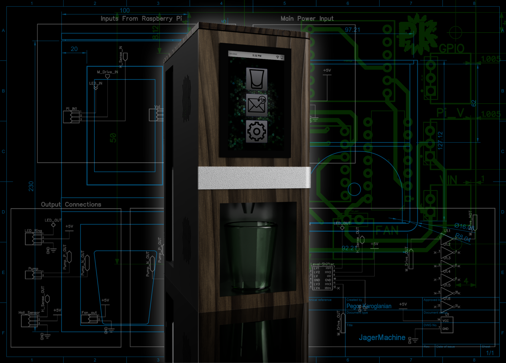
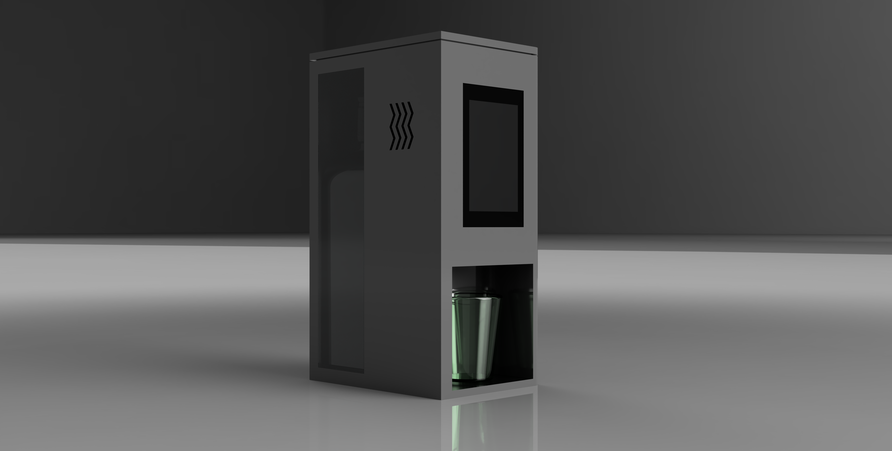
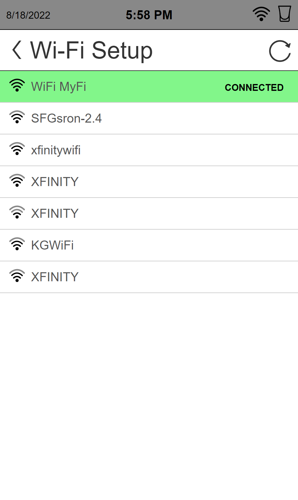
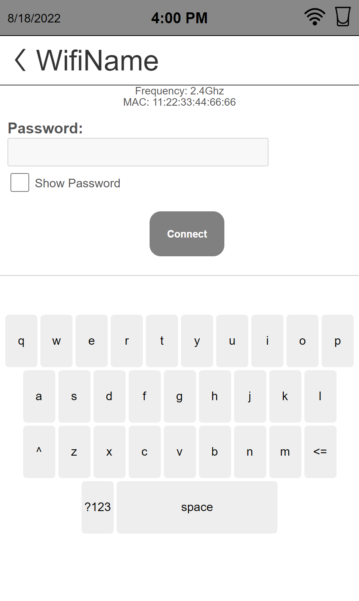
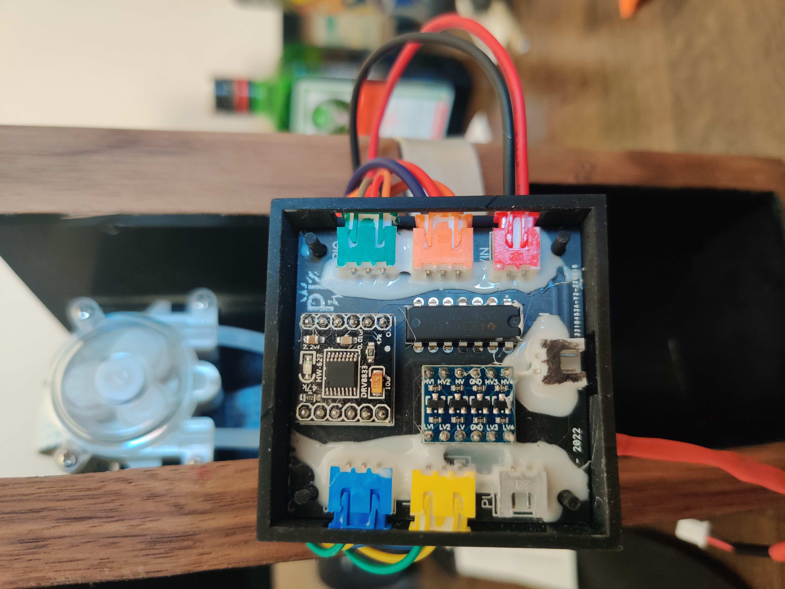

# JÄGERMACHINE
<div align="center">
  
</div>

The JägerMachine is an IoT shot pouring machine powered by a Raspberry Pi 3B+. It features a full GUI that allows the user to configure the device, pour a shot, and also check previous messages sent to the machine. Once paired with it's own GMail account, the JägerMachine waits for emails containing a secret user defined subject line and a custom message that gets displayed on the screen. Once an email is received a shot is poured :) 

Initially this project started as a gift for a friend. We always give each other Jagermeister related gifts as an inside joke, so I figured this would be PERFECT. It started out as a pretty bland render I threw together on Fusion 360 as seen below and slowly started getting more and more complicated.


<div align="center">
  
  <br><b>Figure 1</b>: First render of the initial design.
</div>

Unfortunately I didn't finish the project in time for my friends birthday (sorry Jon :( ), but I continued on and kept adding features and I think It's finally done! Some of the features currently supported are as mentioned above are:
* Search for available WiFi connections and connect to them (see Figure 2 & 3).
* Manually pour a shot.
* Pour a shot via email with a a message that gets displayed.
* Hall effect sensor to detect when shot glass is placed/removed.
* Enable/Disable LEDs

<div align="center">
    <table align="center">
        <tr>
            <td>
                <div align="center">
                    
                    <br><b>Figure 2.</b>: Available WiFi connections list.
                </div>
            </td>
            <td>
                <div align="center">
                    
                    <br><b>Figure 3</b>: Signing in to a WiFi connection.
                </div>
            </td>
        <tr>
    </table>
</div>
The hardware for this build wasn't too complicated. I used a logic level shifter to drive the WS2812B LED Ring since it requires 5V logic and RPi outputs 3.3V logic and an H-Bridge Motor driver module for the pump. The only funky part was that I had to use a Hex-Invert IC since the pins I decided to use on the Raspberry Pi are normally high until they are configured as outputs. 

To avoid having a ton of wires everywhere I designed a motherboard PCB that the breakout boards can easily pop onto. The files & schematic for this PCB are in the `Hardware` folder of this repo. The completed board can be seen below. 

<div align="center">
    
    <br><b>Figure 4</b>: PCB to connect all peripherals.
</div>

Overall I'd say I got pretty close to the render and vision I originally had in mind. Below are a couple pictures of the JägerMachine booting and pouring a shot.


<div align="center">
    
    <br><b>Figure 5.</b>: JägerMachine booting.
</div>

<div align="center">
    
    <br><b>Figure 6.</b>: JägerMachine pouring a shot.
</div>

<div align="center">
    
    <br><b>Figure 7.</b>: JägerMachine idle.
</div>


<b>More detailed info on the Raspberry Pi setup can be found below and more pictures are available in the `Images` folder.<b>

<br>


The build parts consist of:
* [3.5" DSI Touch Screen](https://www.amazon.com/dp/B08634Y16L?psc=1&ref=ppx_yo2ov_dt_b_product_details)
* [Peristaltic Pump](https://www.amazon.com/gp/product/B00HLCOXFI/ref=ppx_yo_dt_b_asin_title_o08_s00?ie=UTF8&psc=1)
* [WS2812B LED Ring](https://www.amazon.com/gp/product/B09B3K2XZL/ref=ppx_yo_dt_b_asin_title_o07_s00?ie=UTF8&psc=1)
* [Hall Effect Sensor](https://www.amazon.com/gp/product/B096S7Y2KH/ref=ppx_yo_dt_b_asin_title_o05_s00?ie=UTF8&psc=1)
* [Motor Drive Module (for pump)](https://www.amazon.com/gp/product/B08RMWTDLM/ref=ppx_yo_dt_b_asin_title_o06_s01?ie=UTF8&psc=1)
* [3.3V to 5V Level Shift (for LED ring)](https://www.amazon.com/HiLetgo-Channels-Converter-Bi-Directional-3-3V-5V/dp/B07F7W91LC)
* USB Storage (used to store WiFi info)
* (Optional) Custom PCB (Designed in DipTrace, ordered from PCBWay)
* (Optional) Custom 3D Printed Parts (enclosures, nozzle, pump holder, fan holder)(Designed in Fusion360 ordered from CraftCloud)

## Raspberry Pi Setup Instructions
1)	[Configure Rpi to Kiosk Mode](https://desertbot.io/blog/raspberry-pi-4-touchscreen-kiosk-setup-64-bit-bullseye)
1)	[Install NGINX Webserver (w/ PHP Installation)](https://pimylifeup.com/raspberry-pi-nginx/)
1)	[Enable Root SSH](https://howtovmlinux.com/articles/rasberry-pi/enable-root-login-and-change-password-raspberrypi/)
1)	[Disable BT (optional)](https://di-marco.net/blog/it/2020-04-18-tips-disabling_bluetooth_on_raspberry_pi/)
1)	[Rotate LCD (optional)](https://osoyoo.com/2019/09/20/instruction-for-raspberry-pi-5-dsi-touch-screen/)
1)	[Enable GPIOs](https://pimylifeup.com/raspberry-pi-gpio/)
1)	[Setup NeoPixel libraries](https://learn.adafruit.com/neopixels-on-raspberry-pi/python-usage)
1)	[Setup automount usb flash drive](https://www.shellhacks.com/raspberry-pi-mount-usb-drive-automatically/)
1)	[Add custom splash  (optional)](https://forums.raspberrypi.com/viewtopic.php?t=276545)
1)	[Remove warranty text and other text](https://blog.smittytone.net/2020/05/23/how-to-remove-a-pis-login-message/)
    1) [Hide all boot text](https://techoverflow.net/2021/10/19/how-to-hide-all-boot-text-blinking-cursor-on-raspberry-pi/)
    1) [Hide xorg messages](https://unix.stackexchange.com/questions/110805/debian-squeeze-hide-xorg-start-messages)
1)	[Give root privilege to custom script `runRoot.sh`](https://superuser.com/questions/1448987/allow-php-to-run-shell-script-with-sudo-permission)
1)  Copy over the folders in the `Software` folder (`custom_scripts`, `flags`, `html`, `services`) onto the Raspberry Pi, placing them in `/var/www/`
1)	`Chmod +x` all the scripts under `custom_scripts` folder.
1)	Link the services in the `services` folder to <b>systemd</b>
    1) `boot_complete.service`:
        ```
            systemctl enable /var/www/services/boot_complete.service
        ```
    1) `glass_check.service`:
        ```
            systemctl enable /var/www/services/glass_check.service
        ```
    1) `email_check.service`:
        ```
            systemctl enable /var/www/services/email_check.service
        ```
    1) `wifi_check.service`:
        ```
            systemctl enable /var/www/services/wifi_check.service
        ```
    1) `led_boot.service`:
        ```
            systemctl enable /var/www/services/led_boot.service
        ```
1) Edit the `emailConfig.py` file to your desired email configuration. You must use a GMail account that has two-factor authentication so you can use an app password. [More info on app passwords](https://support.google.com/accounts/answer/185833?hl=en)

### Contact
[Buy me a Coffee!](https://www.buymeacoffee.com/pegor)
<br>
devPegor@gmail.com
